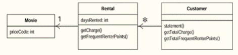

# 重构
## 一. rental重构
### 方法共性以及职责提取

A. 代码包路径:`v2`

B. UML图

#### 拆分`statement()`
1. 责任划分
   1. `switch`中的`priceCode`价格代码判断这价格获取应该属于`Rental.class`类的责任.
       将`switch`中获取价格提取到`Rental.class`类中,并修改合适的方法名为`getCharge()`.
   2. 累计积分方法责任提取`frequentRenterPoints`,提取到`Rental.class`类.命名方法为`getTotalFrequentRenterPoints()`.
2. 消除局部变量:它们只在自己所属的函数中有效，所以它们会助长「冗长而复杂」的函数
   1. 消除`thisAmount`变量,通过直接调用`Rental.getCharge()`方法获取.
   2. 消除`frequentRenterPoints`变量,增加方法`Customer.getTotalFrequentRenterPoints()`.
   3. 消除`totalAmount`变量,增加方法`getTotalCharge()`.
> 通过以上两种方式进行处理进行责任划分,有效的提高方法的可用性.
### 使用多态

A. 代码包路径:`v3`

B. UML图

#### 进一步优化职责
> 价格和积分按照职责来说`getCharge()`和`getTotalFrequentRenterPoints()`方法中处理的逻辑更多的属于`Movie.class`的处理.
1. 将`Rental.getCharge()`和`Rental.getTotalFrequentRenterPoints()`方法移动到`Movie.class`内.
   1. 里面计算涉及到了租期(`daysRented`)变量,需要将`daysRented`传入.
   2. 移动之后两个方法:`Movie.getCharge(int daysRented)`和`Movie.getFrequentRenterPoints(int daysRented)`
#### 多态
> 影片类型是根据价格类型(代号)进行转换的.受价格的影响,新片可以转换为普通片,所以引入`State设计模式`,将价格进行抽象.
- 分别抽象为:普通片价格,儿童片价格,新片价格类.
- 这样进行抽象可以更好的扩展

